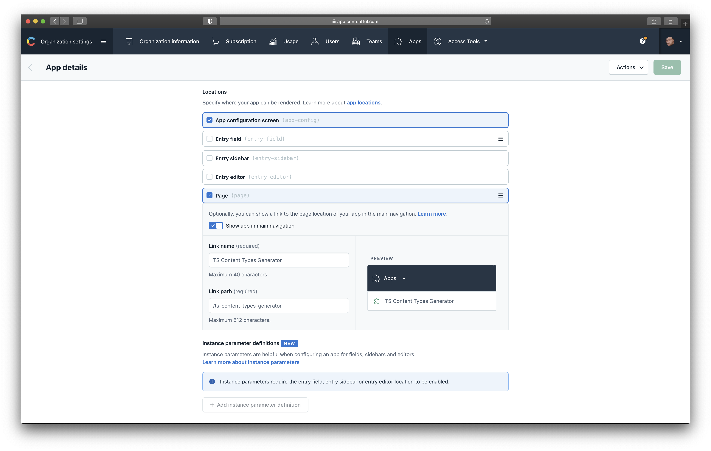

# TS Content Types Generator App

> A [Contentful App](https://www.contentful.com/developers/docs/extensibility/app-framework/) to generate typescript types based on contentful's content types.

This project was bootstrapped with [Create Contentful App](https://github.com/contentful/create-contentful-app), and deployed to [https://cf-content-types-generator-app.netlify.app](https://cf-content-types-generator-app.netlify.app/)

## Setup

[The Contentful App Framework](https://www.contentful.com/developers/docs/extensibility/app-framework/) allows developers to extend the Contentful UI with custom functionality. You can install the app and use its hosted version without editing any code.

To install and develop this app head over to your organization settings and create a new app.

Define the application name you prefer and the following App URL: `https://cf-content-types-generator-app.netlify.app`.

This app supports the following locations in the Contentful UI:

- (Required) Page (`page`) - use TS Content Types Generator app as a full page app

> Thank you [Stefan Judis](https://github.com/stefanjudis) for letting me steal your [Setup description](https://github.com/stefanjudis/contentful-graphql-playground-app) :star:

## Available Scripts

In the project directory, you can run:

#### `npm start`

Creates or updates your app definition in contentful, and runs the app in development mode. Open your app to view it in
the browser.

The page will reload if you make edits. You will also see any lint errors in the console.

#### `npm run build`

Builds the app for production to the `build` folder. It correctly bundles React in production mode and optimizes the
build for the best performance.

The build is minified and the filenames include the hashes. Your app is ready to be deployed!

## Libraries to use

To make your app look and feel like Contentful use the following libraries:

- [Forma 36](https://f36.contentful.com/) – Contentful's design system
- [Contentful Field Editors](https://www.contentful.com/developers/docs/extensibility/field-editors/) – Contentful's
  field editor React components

## Learn More

[Read more](https://www.contentful.com/developers/docs/extensibility/app-framework/create-contentful-app/) and check out
the video on how to use the CLI.

Create Contentful App uses [Create React App](https://create-react-app.dev/). You can learn more in
the [Create React App documentation](https://facebook.github.io/create-react-app/docs/getting-started) and how to
further customize your app.
